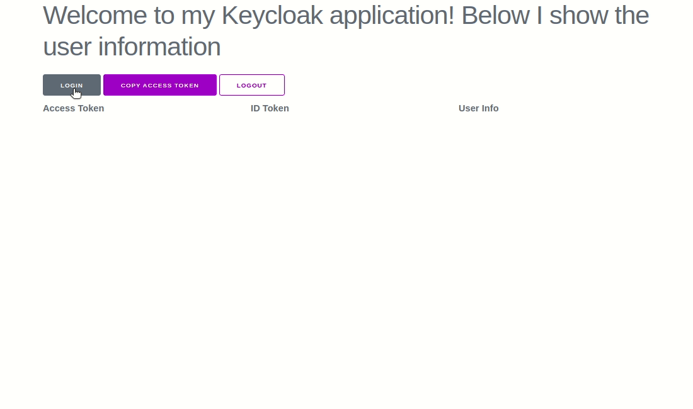

# Keycloak User Data Display

A repository to display Keycloak user information, including access token, ID token and User Info, on an intuitive and easy-to-understand HTML page.

## Demo

In summary, here's how the project works.

## Parameters

You need to fill the params below:

- `url`: TO DO.
- `realm`: TO DO.
- `clientId`: TO DO.
- `redirectUriEncoder`: TO DO.
- `redirectUri`: TO DO.

## Requirements

- Docker
- Docker Compose

## Docker Images

- Docker image for the Keycloak: [Quay.io - Keycloak Image](https://quay.io/repository/keycloak/keycloak)
- Docker image for the Nginx : [DockerHub - Nginx Image](https://hub.docker.com/_/nginx)

## How to Run

To run the project, follow these steps:

1. Clone this repository.
2. Navigate to the project directory and go to the keycloak folder.
3. Run the command `docker-compose up`.
4. Open the browser and go to [http://127.0.0.1:8000/index.html](http://127.0.0.1:8000/index.html).

## License

This project is licensed under the [MIT License](LICENSE).
